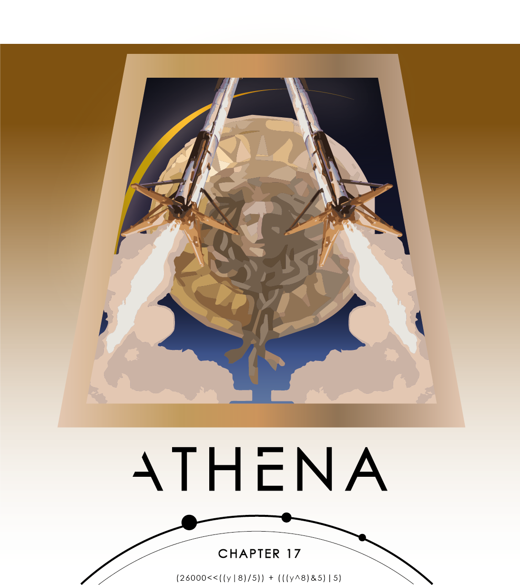

# Athena.NET
Athena often given the epithet Pallas, is an ancient Greek goddess associated with wisdom, warfare, and handicraft who was later syncretized with the Roman goddess Minerva. Athena was regarded as the patron and protectress of various cities across Greece, particularly the city of Athens, from which she most likely received her name. [Wikipedia](https://en.wikipedia.org/wiki/Athena)

---
>>Athena as a small scripting language with similar syntax to C#, is implemented with a pretty enormous abstract structure. As you probably realized, Athena is really hard to read. We are looking forward to create any type of documentation, which can reduce in a some way readablity.
---
- Lexical Analyzer

- Parser graph visualizer

- Abstract syntax tree parser

- Interpreter

### The development starts after: 24 days
